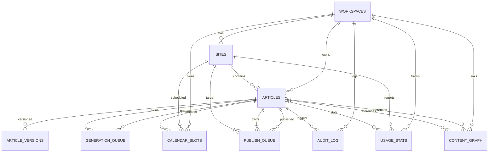

# Architecture Document — AI Auto Content Generator

## 1. Overview

**Nama Aplikasi**: AI Auto Content Generator  
**Hosting Target**: Cloudflare (Pages + Pages Functions + D1 + KV + R2 + Durable Objects)  
**Framework**: Astro (SSG + Islands) + React/Preact untuk interactive UI  
**Pattern**: Serverless-first (no dedicated VMs); local-first editor (IndexedDB)  
**Auth**: GitHub OAuth (SaaS-level) → future-proof untuk multi-user  

---

## 2. Tech Stack

| Layer | Technology | Rationale |
|-------|-----------|-----------|
| **Frontend** | Astro + React/Preact islands | Zero-JS by default, islands for interactive parts (calendar, editor, charts), fast on Pages |
| **Backend** | Cloudflare Pages Functions + Durable Objects | Serverless, edge-native, free tier sufficient |
| **Database** | Cloudflare D1 | SQL relational (joins, transactions needed for articles/sites/templates) |
| **Cache** | Cloudflare KV | Rate limits, model benchmarks, session cache; 1-read-many pattern |
| **Storage** | Cloudflare R2 | Media assets, exports, backups (unlimited, cheap) |
| **Vector** | Cloudflare Vectorize (optional, Phase 2) | Style embeddings, semantic search |
| **Queue** | Durable Objects | Exactly-once generation, per-site ordering, observable state |
| **AI Router** | 9Router (local) → OpenRouter fallback | Free tier, BYOK, local model support |
| **Image Gen** | Pollinations.ai / FLUX (free) | No cost untuk AI images |

---

## 3. Architecture Pattern

```
┌─────────────────────────────────────────────────────────────┐
│                     CLIENT (Browser)                        │
│  Astro Static HTML + React Islands (HTMX fallback)        │
│  IndexedDB (Offline-first editor cache)                     │
└───────────────┬─────────────────────────────────────────────┘
                │ HTTPS
┌───────────────▼─────────────────────────────────────────────┐
│              CLOUDFLARE PAGES (Edge Network)                │
│                                                             │
│  ┌──────────────────┐  ┌──────────────────┐                │
│  │ Pages Function   │  │ Static Assets    │                │
│  │ _worker.ts       │  │ (Astro build)    │                │
│  │ api/[[path]].ts  │  │ .js/.css         │                │
│  └──────────────────┘  └──────────────────┘                │
│           │     │             │                             │
│           │     │             │                             │
│  ┌────────▼─────▼─────────────▼────────┐                    │
│  │       WORKER LOGIC (Functions)       │                    │
│  │                                      │                    │
│  │  • Router (api/[[path]].ts re-export) │                    │
│  │  • Auth middleware (GitHub OAuth)    │                    │
│  │  • API handlers:                     │                   │
│  │    - workspaces.*                    │                    │
│  │    - sites.*                         │                    │
│  │    - articles.*                      │                    │
│  │    - generate.*                      │                    │
│  │    - publish.*                       │                    │
│  │    - calendar.*                      │                    │
│  │    - analytics.*                     │                    │
│  │    - audit.*                         │                    │
│  │  • Validation (Zod schemas)          │                    │
│  │  • Error handling (try/catch + log)  │                    │
│  └────────┬───────────────┬─────────────┘                    │
│           │               │                                  │
│  ┌────────▼──┐   ┌───────▼────────┐                         │
│  │ DURABLE   │   │ AI GENERATION  │                         │
│  │ OBJECTS   │   │ QUEUE (DO)     │                         │
│  │           │   │                │                         │
│  │ • Queue   │◄──┤• Enqueue job   │                         │
│  │ • State   │   │• Call 9Router   │                         │
│  │ • Retry   │   │• Stream chunks │                         │
│  │• Order    │   │• Update state   │                         │
│  └────┬──────┘   └──────┬─────────┘                         │
│       │               │                                     │
│  ┌────▼────────────────▼────────────────────────────────┐  │
│  │                 DATA LAYER                            │  │
│  │                                                       │  │
│  │  D1 (SQLite)       KV              R2                │  │
│  │  • articles        • sessions      • media assets     │  │
│  │  • sites           • rate limits   • exports          │  │
│  │  • workspaces      • model cfg     • backups          │  │
│  │  • templates       • cache         • temp uploads     │  │
│  │  • schedules       • tokens        • drift snapshots  │  │
│  │  • audit_log                                           │  │
│  │  • content_graph                                     │  │
│  └───────────────────────────────────────────────────────┘  │
└─────────────────────────────────────────────────────────────┘
```

---

## 4. D1 Schema Design

```sql
-- D1 migrations/schema.sql
-- Run: npm run db:push (via migrations/ folder)

-- Workspaces (top-level isolation)
CREATE TABLE workspaces (
  id            TEXT PRIMARY KEY,
  name          TEXT NOT NULL,
  description   TEXT,
  default_lang  TEXT DEFAULT 'id',
  timezone      TEXT DEFAULT 'Asia/Jakarta',
  created_at    TEXT DEFAULT (datetime('now')),
  updated_at    TEXT DEFAULT (datetime('now'))
);

-- Sites (connected CMS targets)
CREATE TABLE sites (
  id              TEXT PRIMARY KEY,
  workspace_id    TEXT NOT NULL REFERENCES workspaces(id),
  name            TEXT NOT NULL,
  type            TEXT NOT NULL CHECK (type IN ('wordpress', 'blogger', 'astro', 'custom')),
  -- WP fields
  wp_url          TEXT,
  wp_username     TEXT,
  wp_app_password TEXT,  -- encrypted, stored in KV
  -- Blogger fields
  blogger_blog_id TEXT,
  blogger_refresh_token TEXT, -- encrypted, stored in KV
  -- Astro/Git fields
  github_repo     TEXT,
  github_branch   TEXT DEFAULT 'main',
  github_content_path TEXT DEFAULT 'src/content/posts',
  github_app_id   INTEGER,
  github_installation_id INTEGER,
  -- Custom webhook
  custom_webhook_url TEXT,
  custom_secret   TEXT,
  -- Common
  default_category TEXT,
  default_author   TEXT,
  canonical_prefix TEXT,
  ai_model_default TEXT DEFAULT '9router-claude-writer',
  tone_preset      TEXT DEFAULT 'professional',
  wp_style_dna     TEXT,  -- few-shot examples JSON
  wp_style_vector  BLOB,  -- embedding vector (future: Vectorize)
  created_at      TEXT DEFAULT (datetime('now')),
  updated_at      TEXT DEFAULT (datetime('now')),
  last_sync_at    TEXT,
  is_active       INTEGER DEFAULT 1
);

-- Articles (master record)
CREATE TABLE articles (
  id              TEXT PRIMARY KEY,
  workspace_id    TEXT NOT NULL REFERENCES workspaces(id),
  site_id         TEXT NOT NULL REFERENCES sites(id),
  title           TEXT,
  slug            TEXT,
  status          TEXT NOT NULL CHECK (status IN ('draft', 'outline', 'review', 'queued', 'generating', 'ready', 'scheduled', 'publishing', 'published', 'failed')),
  intent          TEXT CHECK (intent IN ('informational', 'commercial', 'transactional')),
  target_words    INTEGER,
  niche           TEXT,
  tone_preset     TEXT,
  ai_model_used   TEXT,
  content_md      TEXT,  -- full markdown
  frontmatter_json TEXT,  -- JSON string of frontmatter
  outline_json    TEXT,  -- JSON of outline steps
  created_at      TEXT DEFAULT (datetime('now')),
  updated_at      TEXT DEFAULT (datetime('now')),
  scheduled_for   TEXT,  -- ISO datetime
  published_at    TEXT,  -- ISO datetime
  published_url   TEXT,
  publish_error   TEXT,
  version         INTEGER DEFAULT 1
);

-- Article versions (history)
CREATE TABLE article_versions (
  id              INTEGER PRIMARY KEY AUTOINCREMENT,
  article_id      TEXT NOT NULL REFERENCES articles(id),
  version         INTEGER NOT NULL,
  frontmatter_json TEXT,
  content_md      TEXT,
  changed_by      TEXT,  -- 'system' or 'user'
  changed_at      TEXT DEFAULT (datetime('now')),
  diff_data       TEXT  -- JSON diff summary
);

-- Generation queue (powered by Durable Object)
CREATE TABLE generation_queue (
  id              TEXT PRIMARY KEY,
  article_id      TEXT NOT NULL REFERENCES articles(id),
  status          TEXT NOT NULL CHECK (status IN ('queued', 'processing', 'completed', 'failed')),
  model_name      TEXT,
  prompt_data     TEXT,   -- JSON prompt
  result_json     TEXT,   -- JSON output or error
  retry_count     INTEGER DEFAULT 0,
  max_retries     INTEGER DEFAULT 3,
  created_at      TEXT DEFAULT (datetime('now')),
  started_at      TEXT,
  completed_at    TEXT,
  error_message   TEXT
);

-- Publish queue
CREATE TABLE publish_queue (
  id              TEXT PRIMARY KEY,
  article_id      TEXT NOT NULL REFERENCES articles(id),
  site_id         TEXT NOT NULL REFERENCES sites(id),
  status          TEXT NOT NULL CHECK (status IN ('pending', 'processing', 'success', 'failed', 'retry')),
  scheduled_for   TEXT,
  payload_json    TEXT,  -- CMS-specific payload
  response_json   TEXT,  -- CMS response
  error_message   TEXT,
  retry_count     INTEGER DEFAULT 0,
  max_retries     INTEGER DEFAULT 3,
  created_at      TEXT DEFAULT (datetime('now')),
  processed_at    TEXT,
  completed_at    TEXT
);

-- Content calendar slots
CREATE TABLE calendar_slots (
  id              TEXT PRIMARY KEY,
  workspace_id    TEXT NOT NULL,
  site_id         TEXT,
  article_id      TEXT,
  slot_datetime   TEXT NOT NULL,  -- ISO datetime
  slot_type       TEXT CHECK (slot_type IN ('generation', 'publish', 'manual')) DEFAULT 'manual',
  is_recurring    INTEGER DEFAULT 0,
  recurrence_rule TEXT,  -- JSON: {freq: 'week', interval: 1, days: ['mon']}
  created_at      TEXT DEFAULT (datetime('now')),
  updated_at      TEXT DEFAULT (datetime('now')),
  UNIQUE(workspace_id, site_id, slot_datetime)
);

-- Audit log
CREATE TABLE audit_log (
  id              INTEGER PRIMARY KEY AUTOINCREMENT,
  workspace_id    TEXT,
  site_id         TEXT,
  article_id      TEXT,
  action          TEXT NOT NULL,  -- 'generated', 'edited', 'scheduled', 'published', etc
  actor           TEXT DEFAULT 'system',
  details_json    TEXT,  -- action-specific details
  created_at      TEXT DEFAULT (datetime('now', 'localtime'))
);

-- Usage analytics
CREATE TABLE usage_stats (
  id              INTEGER PRIMARY KEY AUTOINCREMENT,
  workspace_id    TEXT NOT NULL,
  site_id         TEXT,
  model_name      TEXT,
  action          TEXT NOT NULL,  -- 'generate', 'publish', 'image_gen'
  tokens_input    INTEGER,
  tokens_output   INTEGER,
  estimated_cost_usd REAL,
  duration_ms     INTEGER,
  success         INTEGER,
  error_message   TEXT,
  recorded_at     TEXT DEFAULT (datetime('now', 'localtime'))
);

-- Content graph (cross-site)
CREATE TABLE content_graph (
  id              INTEGER PRIMARY KEY AUTOINCREMENT,
  workspace_id    TEXT NOT NULL,
  source_article_id TEXT,
  target_article_id TEXT,
  relation_type   TEXT NOT NULL CHECK (relation_type IN ('mentions', 'links_to', 'related', 'duplicate_of')),
  strength        REAL DEFAULT 1.0,
  created_at      TEXT DEFAULT (datetime('now'))
);
```

---

## 5. Worker Structure (Pages Functions)

```
src/
├── entry.tsx                          # Astro entry
├── layouts/
│   └── Layout.astro                    # Base layout w/ auth context
├── pages/
│   ├── index.astro                     # Dashboard
│   ├── workspaces/
│   │   ├── index.astro                 # Workspace list
│   │   └── [workspace_id]/
│   │       ├── sites.astro             # Site management
│   │       ├── calendar.astro          # Calendar view
│   │       ├── articles.astro          # Article list
│   │       └── articles/
│   │           ├── [article_id]/index.astro           # View/Edit
│   │           └── [article_id]/generate.astro        # Generation UI
│   └── api/
│       └── [[path]].ts                 # API router (re-export handler)
└── lib/
    ├── server/                         # Server-side logic
    │   ├── db.ts                       # D1 bindings + queries
    │   ├── auth.ts                     # GitHub OAuth handler
    │   ├── cms/
    │   │   ├── wordpress.ts
    │   │   ├── blogger.ts
    │   │   └── astro.ts                # Git/GitHub publish
    │   ├── ai/
    │   │   ├── router.ts               # 9Router/OpenRouter
    │   │   ├── generate.ts             # Outline → article
    │   │   ├── style-dna.ts            # Analyze + few-shot
    │   │   └── image.ts                # Pollinations/FLUX
    │   ├── queue.ts                    # Enqueue generation/publish
    │   ├── scheduler.ts                # Calendar logic
    │   ├── quality.ts                  # Plagiarism, AI detection, readability
    │   └── compliance.ts              # Disclaimer injection
    └── client/
        ├── api.ts                      # Type-safe API client (orval-style)
        └── stores/                     # Zustand/React context
            ├── workspace.ts
            ├── articles.ts
            └── calendar.ts

# Functions entry point
functions/_middleware.ts               # Auth guard, logging
functions/api/[[path]].ts              # Re-export router handler
functions/durable/
└── queue_DO.ts                        # Durable Object for generation queue
```

---

## 6. Pages Functions Configuration

### `_worker.ts` (entry to Pages Functions)
```ts
// functions/_worker.ts
import { route } from '../src/lib/server/api/router';
import { handleAuth } from '../src/lib/server/auth';

export default {
  async fetch(request: Request, env: Env, ctx: ExecutionContext): Promise<Response> {
    const url = new URL(request.url);
    const pathname = url.pathname;

    // Auth middleware
    const authResult = await handleAuth(request, env);
    if (authResult instanceof Response) return authResult;

    // Bind D1, KV, R2, DO to request context
    request.env = { ...env, db: authResult.db, user: authResult.user };

    // Route API calls
    if (pathname.startsWith('/api/')) {
      return route(request, env, ctx);
    }

    // Static assets handled by Astro automatically
    return new Response('Not found', { status: 404 });
  },
};
```

### `wrangler.toml`
```toml
name = "content-generator"
pages_build_output_dir = "dist"

[vars]
NEXT_PUBLIC_APP_NAME = "AI Auto Content Generator"

# Bindings (set via Pages Dashboard → Settings → Functions)
[[durable_objects.bindings]]
name = "QUEUE"
class_name = "Queue"

[[d1_database]]
binding = "DB"
database_name = "content-generator"
# Also bind D1 via Dashboard → Settings → Functions for env var

[triggers]
crons = ["*/5 * * * *"]  # Queue processor every 5 min
```

---

## 7. Durable Object: Generation Queue

### `Queue` class (`functions/durable/queue_DO.ts`)
```ts
export class Queue {
  state: DurableObjectState;
  env: any;

  async fetch(request: Request) {
    const url = new URL(request.url);
    const { pathname } = url;

    if (pathname === '/enqueue') {
      const body = await request.json();
      const job = {
        id: crypto.randomUUID(),
        article_id: body.article_id,
        status: 'queued',
        prompt_data: JSON.stringify(body.prompt),
        retry_count: 0,
        max_retries: 3,
        created_at: new Date().toISOString(),
      };
      await this.state.storage.put(`job:${job.id}`, job);
      await this.state.storage.put(`queue:head`, job.id); // or use a list
      return new Response(JSON.stringify({ job_id: job.id }), { status: 201 });
    }

    if (pathname === '/process') {
      await this.processNext();
      return new Response('ok');
    }

    if (pathname.startsWith('/status/')) {
      const jobId = pathname.split('/')[2];
      const job = await this.state.storage.get(`job:${jobId}`);
      return new Response(JSON.stringify(job), { status: 200 });
    }

    return new Response('Not found', { status: 404 });
  }

  async processNext() {
    const queueHead = await this.state.storage.get<string>('queue:head');
    if (!queueHead) return;

    const job = await this.state.storage.get<any>(`job:${queueHead}`);
    if (!job || job.status !== 'queued') return;

    try {
      job.status = 'processing';
      job.started_at = new Date().toISOString();
      await this.state.storage.put(`job:${job.id}`, job);

      // Call AI router
      const result = await generateArticle(job.prompt_data);

      // Save result
      job.status = 'completed';
      job.result_json = JSON.stringify(result);
      job.completed_at = new Date().toISOString();
      await this.state.storage.put(`job:${job.id}`, job);

      // Update database (async)
      this.ctx.waitUntil(this.updateDB(job));

      // Dispatch next job
      await this.state.storage.delete(`queue:head`);
      const next = await this.state.storage.get<string>('queue:next');
      if (next) {
        await this.state.storage.put('queue:head', next);
        await this.state.storage.delete(`queue:next`);
      }
    } catch (err) {
      job.retry_count++;
      if (job.retry_count >= job.max_retries) {
        job.status = 'failed';
        job.error_message = String(err);
        job.completed_at = new Date().toISOString();
      } else {
        job.status = 'queued'; // requeue
      }
      await this.state.storage.put(`job:${job.id}`, job);
    }
  }

  async updateDB(job: any) {
    // Update D1 articles table with generated content
    // Use env.DB binding
    const stmt = this.env.DB.prepare(
      'UPDATE articles SET status = ?, content_md = ?, frontmatter_json = ?, updated_at = ? WHERE id = ?'
    ).bind(
      job.result.status === 'completed' ? 'ready' : 'failed',
      job.result.content_md,
      job.result.frontmatter_json,
      new Date().toISOString(),
      job.article_id
    );
    await stmt.run();
  }
}
```

---

## 8. Database Schema Relationships



---

## 9. Security Model

| Asset | Protection |
|-------|-----------|
| **OAuth tokens / API keys** | Encrypted → stored in Cloudflare KV (`env.KV.put`) — never in D1 |
| **DB access** | D1 binding only accessible server-side (Pages Functions) — no client access |
| **Auth** | GitHub OAuth v2 → token stored in KV per workspace; middleware checks session |
| **Rate limiting** | KV-based: `rate_limit:{ip}:{endpoint}` with TTL |
| **Input validation** | Zod schemas for every API endpoint |
| **Secrets rotation** | Manual in Pages Dashboard, or script via `npx wrangler pages secret` |

---

## 10. Deployment Pipeline

```
GitHub Repo: dodhee/content-generator
Branch: main
CI/CD: GitHub Actions

Flow:
1. Push to main → trigger `pages-deployment.yml`
2. Astro build → output to ./dist
3. Pages auto-deploy + 301 redirect
4. GitHub Actions: run vitest + db:migrate (D1)
```

### `functions/api/[[path]].ts` (Router)
```ts
import { handleWorkspaces } from './workspaces';
import { handleSites } from './sites';
import { handleArticles } from './articles';
import { handleGenerate } from './generate';
import { handlePublish } from './publish';
import { handleCalendar } from './calendar';
import { handleAnalytics } from './analytics';
import { handleAuth } from './auth';

const routes = {
  '/workspaces*': handleWorkspaces,
  '/sites*': handleSites,
  '/articles*': handleArticles,
  '/generate*': handleGenerate,
  '/publish*': handlePublish,
  '/calendar*': handleCalendar,
  '/analytics*': handleAnalytics,
  '/auth*': handleAuth,
};

export const onRequest: ExportedHandler<Env> = async (context) => {
  const { request, env, params } = context;
  const url = new URL(request.url);
  const path = url.pathname.replace('/api/', '/');

  for (const [pattern, handler] of Object.entries(routes)) {
    if (new URLPattern(pattern).test(url)) {
      return handler(request, env, params);
    }
  }

  return new Response('API route not found', { status: 404 });
};
```